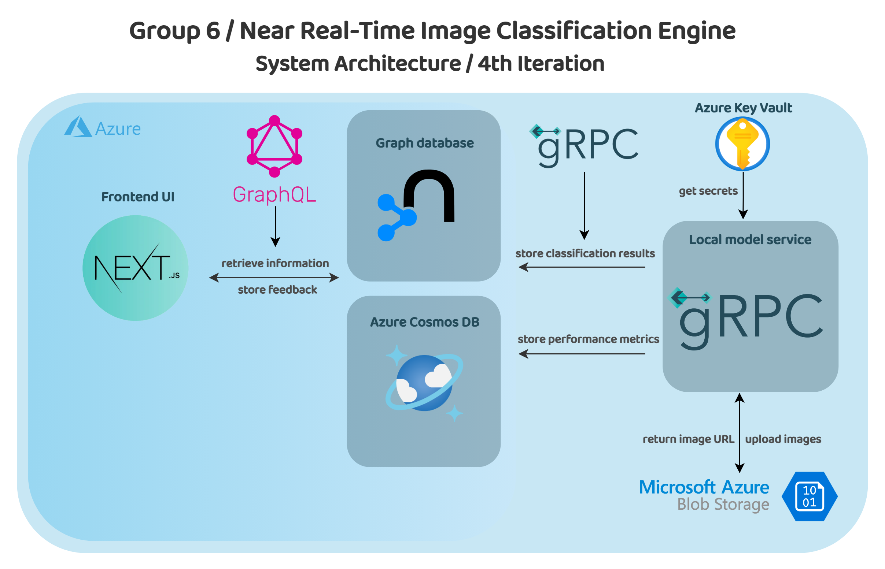

## Near Real-Time Image Classification Engine

### Overview

**SixSense** is a near real-time image classification engine designed to provide real-time image classification capabilities in a hybrid edge and cloud infrastructure. Developed in collaboration with **TOMRA Sorting Ltd**, this project focuses on leveraging pre-trained models to classify images and improve model accuracy through user feedback. The system is designed to be deployed across both edge and cloud environments, ensuring scalability and flexibility.

### Key Features

- **Near Real-Time Image Classification**: Classify images in near real-time using pre-trained models.
- **Performance Monitoring**: Continuously track the performance of the classification engine.
- **User Feedback Mechanism**: Allow users to provide feedback on misclassifications to improve model accuracy.
- **Hybrid Deployment**: Deploy the classification engine across both edge and cloud environments.

### Functional Requirements

To achieve the project's vision, the following functional requirements must be addressed:

1. **Classification Engine**:
   - Develop an image classification engine that processes images in near real-time.
   - Leverage pre-trained models for image classification.
   - Support deployment in both edge and cloud environments.

2. **Performance Monitoring**:
   - Continuously monitor the performance of the classification engine.
   - Track metrics such as classification accuracy, latency, and precision.

3. **User Feedback Mechanism**:
   - Implement a system for users to provide feedback on misclassifications.
   - Store feedback to be used to improve model performance over time.

4. **Scalability**:
   - The system should support deployment across multiple edge devices and cloud instances, ensuring it can scale with demand.

5. **Lightweight Design**:
   - The classification engine should be lightweight to ensure it can run efficiently on edge devices with limited resources.

### System Architecture

The system architecture consists of the following components:

1. **Local Model Service**: Processes images using user-selected models, stores images in Azure Blob Storage and communicates via gRPC
2. **Neo4j Graph Database**: Stores Azure Blob Storage image URLs, classification results, and other classification metadata
3. **Cosmos DB**: Receives and stores per-image metrics from the processing pipeline
4. **Next.js Frontend**: Displays data and collects user feedback, communicating with both databases

The following diagram shows the different components of the product we are aiming for. The goal is to have our local model service process images selected by users, communicating with a Neo4j graph database for storing image references and classification results. Metrics for each processed image are sent to Cosmos DB, while the Next.js frontend pulls data from both databases to display results and collect user feedback, which is then stored back in Neo4j.

We plan to achieve this architecture incrementally by first simulating locally the processing pipeline using sample images and a local Neo4j instance. Then we will test the integration with Azure Blob Storage and Cosmos DB when we feel comfortable moving to cloud-based resources.

## The Team

### Team Leads 

- **Radi (Leila) Adil** - 3rd Year 
- **Cindy Ariyo** - 3rd Year
- **Victor Dalessandris** - 3rd Year
- **Ayomide Ifedolapo Oyelakun** - 3rd Year

### Frontend 

- **Patrick Phibbs** - 2nd Year
- **Hong Shen** - 2nd Year

### Backend 

- **George Diarmuid Levins** - 2nd Year
- **Ionut George Adadi** - 2nd Year
- **Junyi Xia** - 2nd Year
